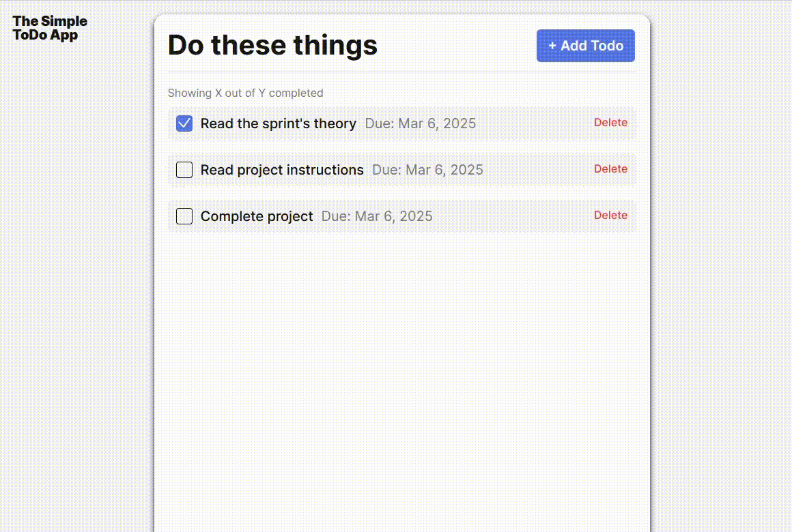

# Simple Todo App

Just a quick, minimal way to help manage tasks and stay organized.

## Functionality

An all in one spot place to view list of tasks with actions to:

- Create task
- Set deadlines (optional)
- Mark tasks off
- Delete tasks

## Technology

Technologies used: HTML, CSS, and Javascript. Structured code with encapsulated modules to seperate form validation and todo task generation, keeping index.js organized. Using UUID package to prevent todo task conflict.

## Deployment

This project is deployed on GitHub Pages:

https://willmarl.github.io/se_project_todo-app/
